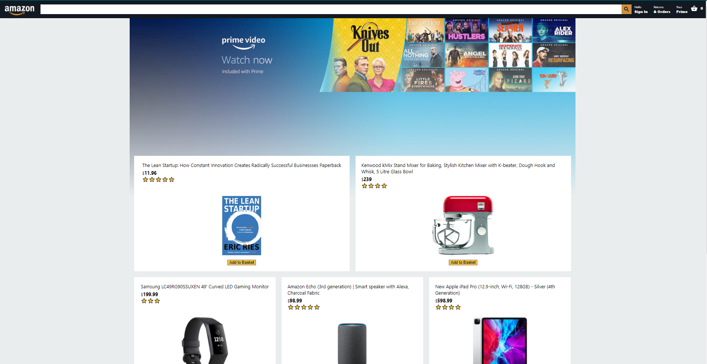

# Amazon Clone

## React



## [Live Site](https://fir-fc2a0.firebaseapp.com/)


# Usage
Create a firebase.js file with the code below and add ur own firebase credientials in ' '
```
import firebase from 'firebase';

const firebaseApp = firebase.initializeApp({
  apiKey: '',
  authDomain: '',
  databaseURL: '',
  projectId: '',
  storageBucket: '',
  messagingSenderId: '',
  appId: '',
});

const db = firebaseApp.firestore();
const auth = firebase.auth();
const storage = firebase.storage();

export { db, auth, storage };

```

## Install Dependencies
```
npm install
```

## Run App
```
npm start
```